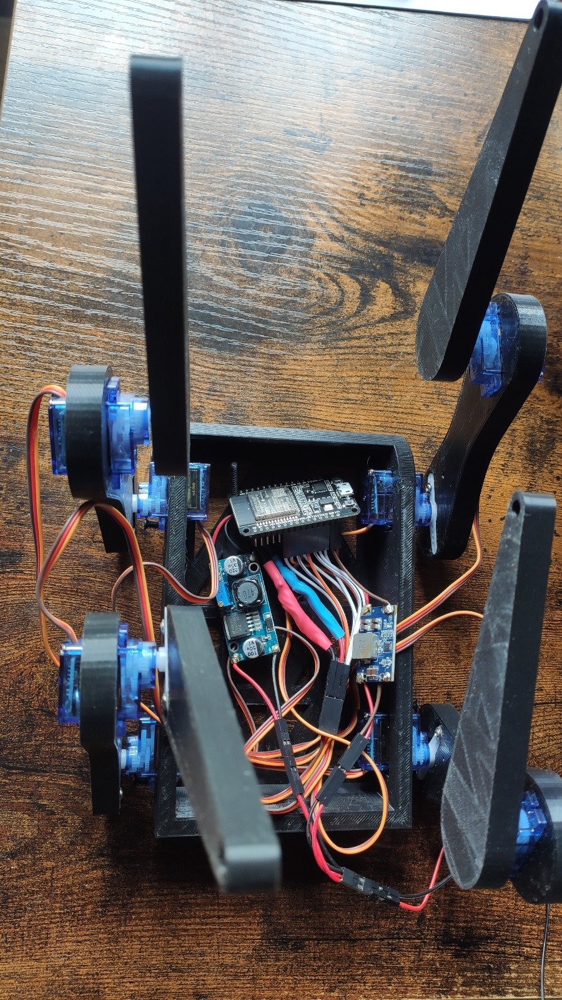
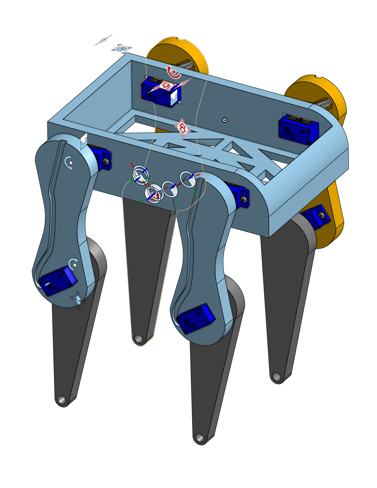

# ByteDog - An Ultra Low-Cost Robot Dog

ByteDog is an open-source project aimed at making robotics accessible to everyone through a low-cost, easy-to-assemble, and programmable quadruped robot.

    
    

## 🚀 Objective
The goal of ByteDog is to provide a simple and affordable platform for experimenting with quadruped robotics without breaking the bank.

## 🛠️ Required Materials (BOM)
All components were purchased at very low cost from AliExpress:

- **Microcontroller**: ESP32 DevKit
- **Servomotors**: 8x SG90
- **Voltage Converter**: LM2596 Module
- **Charging Module**: TP4056 (for Li-ion battery)
- **Battery**: A Li-ion cell or 2S LiPo pack
- **Wiring**: Dupont wires and soldering
- **Chassis and Legs**: 3D-printed parts
- **Screws & Spacers**

## 🔧 Assembly
1. **Print the parts**: Download and print the STL files.
2. **Install the servomotors**: Attach all 8 servos to the chassis.
3. **Wiring**: Connect the servos to the ESP32 using a breadboard or PCB.
4. **Power Supply**: Add the battery and voltage regulator.
5. **Test the movements**: Flash the firmware and check the first steps.

## 💾 Code Installation
1. Install PlatformIO or Arduino IDE.
2. Download the firmware from this repository.
3. Flash the code onto the ESP32 via USB.
4. Adjust servo parameters if necessary.

## 🔮 Next
1. Interface with Blender to add animations.
2. Over charge the motors to increase load capacity.
3. Add new comunication protocol for instant control.
---

ByteDog is open-source licensed. Experiment, improve, and have fun! 🐶🤖

